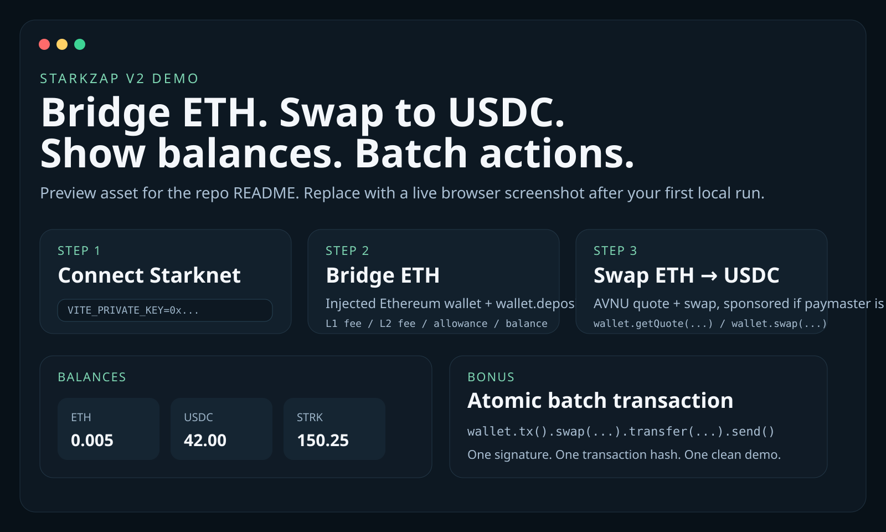

# starkzap-bridge-swap-demo

Minimal React + Vite demo that connects a Starknet signer wallet, bridges ETH from Ethereum into Starknet, swaps ETH to USDC through AVNU, renders balances, and shows a batch `swap + transfer` flow.

GitHub repo: [Zhekinmaksim/starkzap-bridge-swap-demo](https://github.com/Zhekinmaksim/starkzap-bridge-swap-demo)



## What this demo shows

- Starknet wallet setup with `StarkZap`, `StarkSigner`, `connectWallet()`, and `ensureReady()`
- Ethereum bridge setup with `sdk.getBridgingTokens(...)`, an injected EVM wallet, and `wallet.deposit(...)`
- AVNU quote + swap flow through `wallet.getQuote(...)` and `wallet.swap(...)`
- Balance rendering through `wallet.balanceOf(...)` and `Amount.toFormatted()`
- Atomic `wallet.tx().swap(...).transfer(...).send()` batching

## Quick start

```bash
cp .env.example .env
npm install
npm run dev
```

Open the Vite app and work through the flow in this order:

1. Connect the Starknet signer wallet.
2. Connect an injected Ethereum wallet on Sepolia.
3. Bridge ETH into Starknet.
4. Quote and execute the ETH -> USDC swap.
5. Refresh balances and test the batch transaction.

## Environment

The demo uses Vite client env vars, so the private key must be prefixed with `VITE_`.

```bash
VITE_PRIVATE_KEY=0x...
VITE_STARKNET_NETWORK=sepolia
VITE_ETHEREUM_RPC_URL=https://eth-sepolia.g.alchemy.com/v2/...
VITE_PAYMASTER_URL=https://sepolia.paymaster.avnu.fi
VITE_RECIPIENT=0x...
```

## Notes that matter

- Testnet only. This demo keeps a Starknet private key in the browser bundle for speed. Do not use a real wallet.
- `ethers` is included on purpose. Starkzap's current bridge flow for Ethereum depends on the optional `ethers` peer dependency.
- Sponsored mode is exposed in the UI, but a real gasless flow still depends on a working paymaster setup.
- The original brief called this a "BTC bridge" thread, but the actual flow here is ETH end-to-end: bridge ETH, then swap ETH -> USDC.

## Faucets and references

- Starknet Sepolia faucet: [faucet.starknet.io](https://faucet.starknet.io/)
- Starkzap docs: [docs.starknet.io/build/starkzap/overview](https://docs.starknet.io/build/starkzap/overview)
- Starkzap repo: [github.com/keep-starknet-strange/starkzap](https://github.com/keep-starknet-strange/starkzap)
- Builder group: [Telegram](https://t.me/+I-Vt-_DcvecwNmY0)

## Thread

- Draft thread for this repo: [THREAD.md](./THREAD.md)
- Public repo URL for Tweet 9: [https://github.com/Zhekinmaksim/starkzap-bridge-swap-demo](https://github.com/Zhekinmaksim/starkzap-bridge-swap-demo)
- After publishing, replace this placeholder with the live X/Twitter URL:
  `https://x.com/<your-handle>/status/<tweet-id>`

## Assets

- App preview: [`assets/app-preview.svg`](./assets/app-preview.svg)
- Tweet code card 1: [`assets/tweet-3-sdk-wallet.svg`](./assets/tweet-3-sdk-wallet.svg)
- Tweet code card 2: [`assets/tweet-5-gasless-swap.svg`](./assets/tweet-5-gasless-swap.svg)
- Tweet code card 3: [`assets/tweet-7-batch-tx.svg`](./assets/tweet-7-batch-tx.svg)

The SVGs are repo-ready dark-theme assets. If you want native X attachments, export them to PNG after you run the app locally and capture a real browser shot or GIF.
